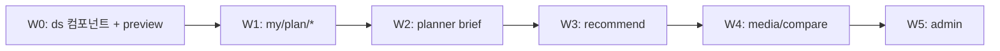

# Design system STEP2 — 점진적 마이그레이션 설계

> **전제 (STEP1 인벤토리 요약)**  
> - 버튼: `components/ui/button.tsx` (~10 variants, rounded-xl) vs `components/brutalist/btn-block.tsx` (primary/secondary/dark/accent, sm/md/lg).  
> - 로딩: `NeonFullPageSpinner`, route `loading.tsx` / `skeletons.tsx`, `Loader2` 산재.  
> - 토큰: `app/globals.css` `--qp-*` — 페이지별 준수도 불균일.

**방향:** 150+ 파일 일괄 교체 금지. **통합 컴포넌트 1세트**를 새로 두고 **라우트(페이지) 단위**로 옮긴다.

---

## 1. 목표

| 영역 | 통합 컴포넌트 | 비목표 (STEP2) |
|------|----------------|----------------|
| 버튼 | `@/components/ds/app-button` | Brutalist / shadcn 파일 삭제 |
| 로딩 | `@/components/ds/app-loading` | 모든 `Loader2` 제거 |
| (선택) | `@/components/ds/app-page-shell` | 레이아웃 전면 통일 |

성공 기준:

- 마이그레이션된 라우트에서 **CTA·보조 버튼·disabled·로딩**이 동일 규칙을 따른다.
- 미마이그레이션 라우트는 **기존 import 유지** (회귀 없음).
- PR은 **한 웨이브 = 1~3개 라우트** 또는 **한 feature 영역**.

---

## 2. `AppButton` API (초안)

파일: `components/ds/app-button.tsx` (+ `app-button.variants.ts` if needed)

```tsx
type AppButtonVariant = "primary" | "secondary" | "ghost" | "danger" | "link";
type AppButtonSize = "sm" | "md" | "lg";

// asChild + Link 지원 (shadcn Slot 패턴)
// loading?: boolean → 스피너 + aria-busy, 클릭 차단
// fullWidth?: boolean
```

**매핑 규칙 (마이그레이션 시)**

| 기존 | → AppButton |
|------|-------------|
| `BtnBlock` variant accent/primary | `primary` |
| `BtnBlock` secondary | `secondary` |
| `BtnBlock` dark | `primary` + `className` dark surface (또는 `surface="dark"`) |
| `Button` default | `primary` |
| `Button` outline / ghost | `secondary` / `ghost` |
| `Button` destructive | `danger` |

**시각:** QP 토큰 (`--qp-accent`, `--qp-radius-md`)을 **단일 소스**로; Brutalist 0-radius는 `variant="block"` opt-in으로만 유지 (마이페이지·랜딩 일부).

**테스트:** Storybook 또는 `app/(dev)/ds-preview` (내부 only) — variant × size × loading 스냅샷.

---

## 3. `AppLoading` API (초안)

파일: `components/ds/app-loading.tsx`

```tsx
type AppLoadingProps =
  | { mode: "inline"; label?: string; className?: string }
  | { mode: "section"; label?: string }
  | { mode: "page"; label?: string }; // NeonFullPageSpinner 래핑
```

**매핑**

| 기존 | → |
|------|---|
| `Loader2` + `animate-spin` (버튼 안) | `AppButton loading` |
| 리스트/패널 첫 로드 | `AppLoading mode="section"` |
| `loading.tsx` route | `AppLoading mode="page"` 또는 기존 skeleton 유지 (웨이브별 선택) |

---

## 4. 마이그레이션 웨이브 (제안 순서)



| 웨이브 | 라우트 / 영역 | 이유 |
|--------|----------------|------|
| **W0** | `components/ds/*`, dev preview | 계약 고정 |
| **W1** | `/my/plan`, `/my/plan/saved`, `/my/plan/campaigns`, `/my/plan/report` | 방금 기능 밀집, BtnBlock+Loader2 혼재 |
| **W2** | `/planner` (brief steps) | CTA 많음, shadcn Button |
| **W3** | `/recommend` | 플로우 유사 |
| **W4** | `/media`, `/compare` | 트래픽 높음 — W1–2 패턴 검증 후 |
| **W5** | `/admin/**` | 별도 밀도·테이블 UI, 마지막 |

각 PR 체크리스트:

- [ ] 해당 라우트 E2E 또는 수동 smoke (CTA, empty, error, loading)
- [ ] 다크 모드 스크린샷 1장 (optional)
- [ ] `rg 'from "@/components/brutalist"'` 해당 라우트 tree 감소 확인

---

## 5. ESLint / 가드 (STEP2 후반)

- **Phase A:** 문서 + codemod 스크립트 (`scripts/codemods/button-to-app-button.mjs`) — 수동 PR.
- **Phase B:** `eslint-plugin-local` rule — `app/[locale]/(site)/my/plan/**` 에서 신규 `BtnBlock` import warn.
- **Phase C:** admin 제외 전역 warn → error (타임라인 별도).

---

## 6. 롤백·리스크

- 라우트 단위이므로 **revert 단위 = PR 하나**.
- `AppButton`은 내부적으로 기존 shadcn `Button` 또는 styled span을 쓸 수 있어 **첫 W0는 thin wrapper**로 시작 가능.
- Brutalist 제거는 **W5 이후** 별도 EPIC; STEP2에서는 import 수만 줄인다.

---

## 7. 다음 액션 (구현 착수 순)

1. W0: `app-button.tsx`, `app-loading.tsx`, `/ko/dev/ds` preview (auth gate).
2. W1 PR: `my-campaign-plans-page-client`, `my-saved-plans-page-client`, `my-plan-page-client` → `AppButton` / `AppLoading`.
3. 팀 합의: primary radius (`--qp-radius-lg` vs xl) 한 값 고정.

---

*문서 버전: 2026-09-18 · STEP2 설계만 — 코드 마이그레이션은 W0부터 별도 PR.*
